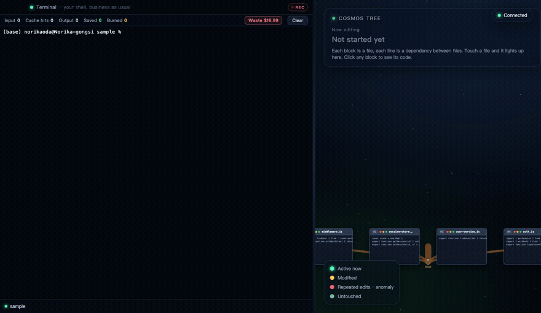
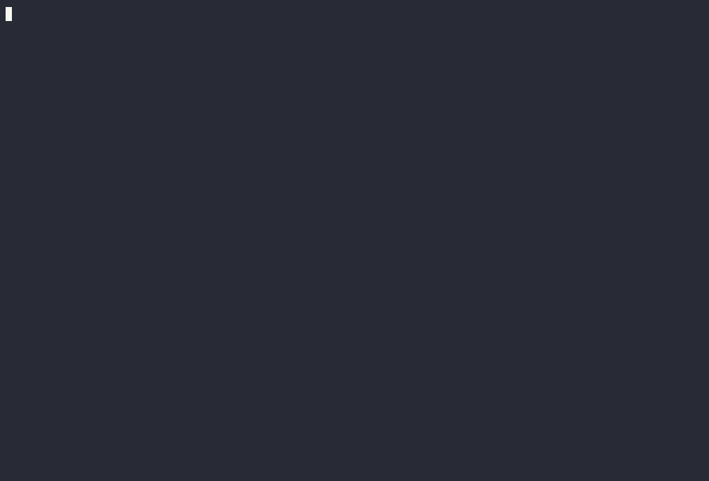

# Code Tree

> Your AI is editing four files right now. You're watching one.

A coding-agent CLI whose view follows whatever file the agent touches. You type a prompt, the agent starts working, and the camera jumps to whichever cell it is editing. Hit Tab to see your whole codebase as a living tree. A token bar shows what you are burning (and what stale cache is wasting), and a safety gate stops the agent before anything irreversible.

It runs on Claude, borrowing your existing Claude Code login, so there is no separate API key to set up. No cloud login at all? It also drives a local model (Ollama, vLLM, llama.cpp) with zero login.

<p align="center">
  
</p>

<p align="center">
  <sub>The world-tree (<code>--web</code>): every block is a file, every line is a dependency. As the agent works, the file it touches lights up green and the camera flies to it. Real, unedited. (<a href="assets/world-tree.mp4">MP4</a>)</sub>
</p>

<p align="center">
  
</p>

<p align="center">
  <sub>The all-in-terminal view: same engine, no browser. Claude reviews this codebase live, the flow trail grows, and the token bar climbs as it burns. (<a href="assets/demo.mp4">MP4</a>)</sub>
</p>

## Install

Run it with no install:

```
npx code-tree .
```

Or install globally:

```
npm i -g code-tree
code-tree .
```

Requires Node 18+. `.` means "open the current project"; pass a path to open a different one, just like `code .`.

## How it follows you

You never tell it which project. The core watches your shell, parses imports into a tree, and as the agent moves, the camera jumps to the file it is touching. Repeated edits flash red. Blocks are files, lines are imports. Nothing leaves your machine.

## Login

Code Tree reuses the session you already have from Claude Code (read from the macOS Keychain). Check the connection:

```
code-tree status
```

If it says it borrowed your Claude Code login, you are ready. If not, run `claude` once in your terminal to log in, then come back. You can also set `ANTHROPIC_API_KEY` instead.

## No-login local mode

Don't want to log into any cloud LLM? Code Tree can write code with a model running on your own machine, no account and no API key. It speaks the OpenAI-compatible protocol, so [Ollama](https://ollama.com), vLLM, llama.cpp server, and LM Studio all work.

The fastest path is Ollama:

```
brew install ollama        # or download from ollama.com
ollama pull qwen2.5-coder  # a small coding model that fits on a laptop
```

Then just run Code Tree. If you are not logged into Claude Code, it auto-detects the local model and uses it. To force local even when you are logged into Claude:

```
code-tree --local <path-to-your-project>
```

It probes, in order: the env vars `CODETREE_LOCAL_URL` / `CODETREE_LOCAL_MODEL` if set, then Ollama on `:11434`, then a generic OpenAI-compatible server on `:8000` or `:1234`. Point it at a beefier box on your network with:

```
CODETREE_LOCAL_URL=http://192.168.1.50:11434/v1 CODETREE_LOCAL_MODEL=qwen2.5-coder code-tree --local .
```

Local models are smaller than Claude, so expect rougher edits.

## Run it

In a real terminal (a TTY, so you can type):

```
code-tree <path-to-your-project>
```

- Type a prompt, press Enter. The agent starts editing; the view follows it cell by cell.
- Tab toggles Focus view and the full Tree view.
- Ctrl+L re-measures wasted cache and shows what clearing would save.
- Ctrl+C to exit.

Want the full browser world-tree at the same time? Add `--web`:

```
code-tree --web <path-to-your-project>
```

A split view opens in your browser: a real terminal on the left, the live world-tree on the right. It follows what you do automatically; you never tell it which project.

## Try the demo (no login needed)

```
code-tree --demo
```

A scripted agent replays a scenario: it edits `session-store.js` three times chasing a bug (that cell flashes red and raises a "not converging" warning), then steps back and finds the real cause in `middleware.js`. Reproducible every run.

## What's inside

- Native agent CLI: prompt streaming to a read/edit/write tool loop
- Focus view: the camera follows the file the agent is editing, with a trail
- Tree view: your whole codebase as a live tree, status-colored, repeated edits flagged
- Token bar: real burn for this session, plus a machine-wide "cost of not clearing your stale cache" figure in USD
- MASL safety gate: speaks up only on the four things that actually matter (irreversible shell commands, breaking a public interface others import, going off-script, and thrashing the same file) instead of nagging on every edit
- Session recording: from open to close, the whole CLI transcript is written to a txt file for later review
- Anomaly detection: same file edited 3+ times flashes red, stalls over 10 minutes, recurring errors
- Borrows Claude Code OAuth (Keychain), falls back to API key
- No-login local mode: drives a local OpenAI-compatible model (Ollama / vLLM / llama.cpp) with zero cloud login, auto-detected

## How it works

```
CLI (Ink) ─┐
           ├─ WebSocket :7778 ─ Core (file watcher + import parser + anomaly + agent runner)
Browser viz :7790 ─┘
```

Fully local. No server dependency, nothing leaves your machine.

## License

MIT © norika
